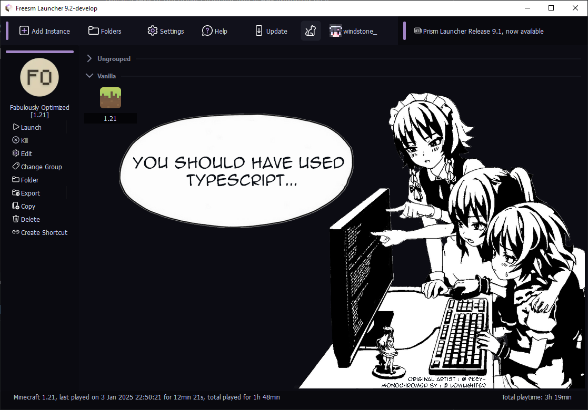
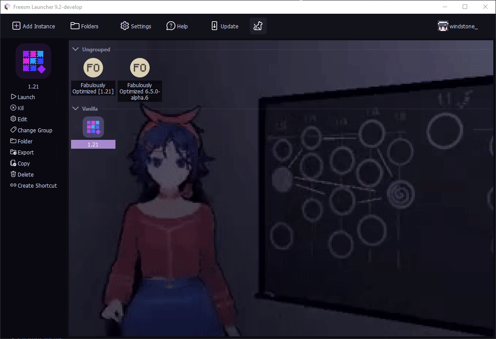
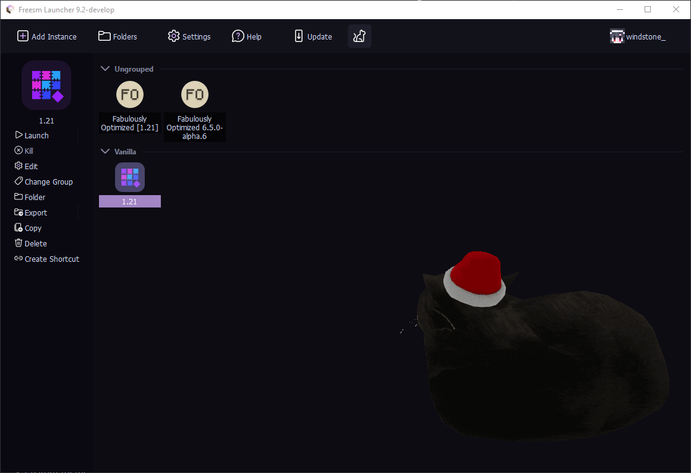
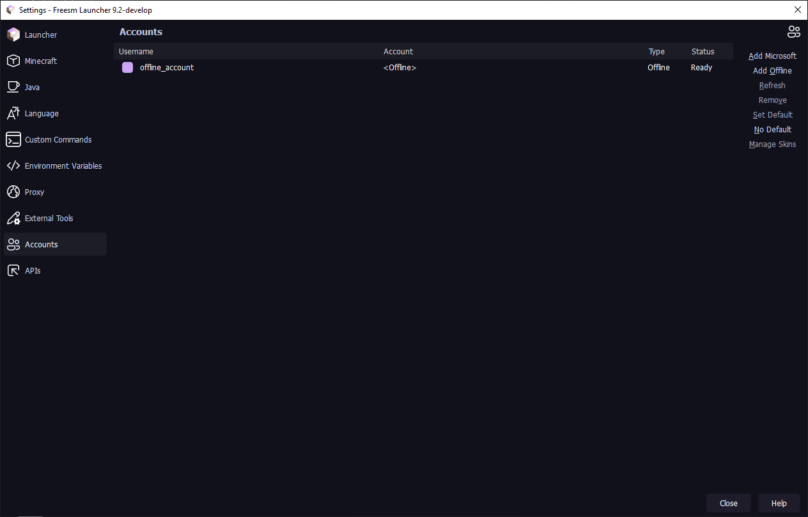
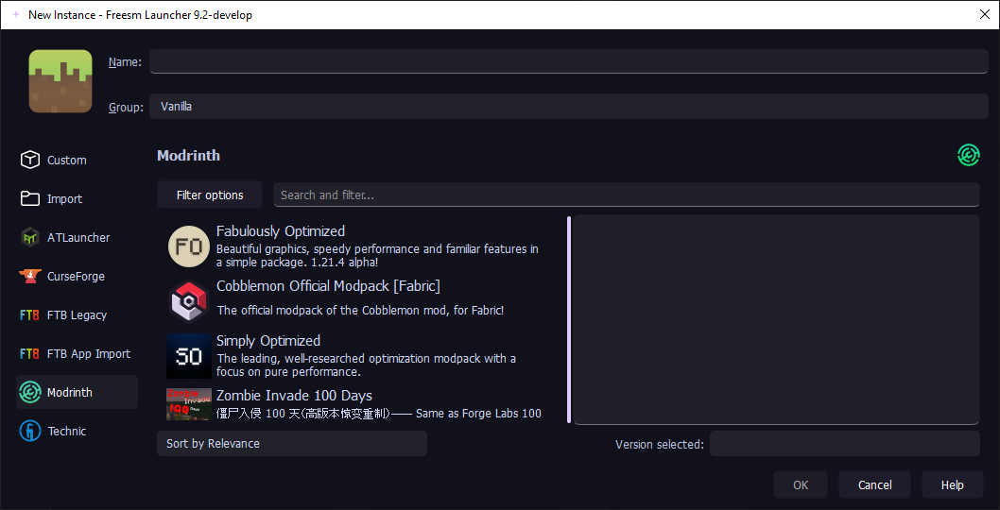
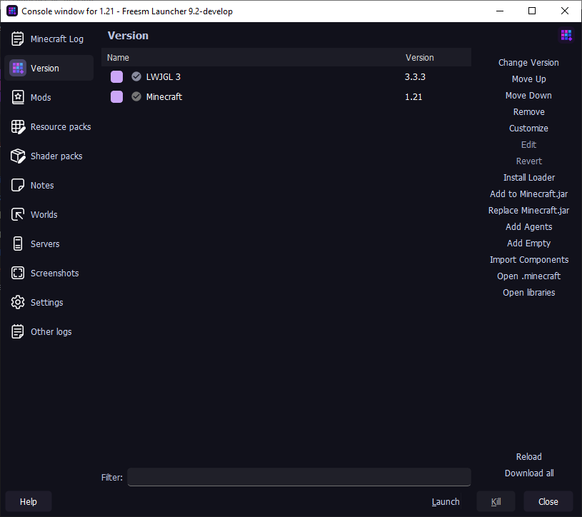
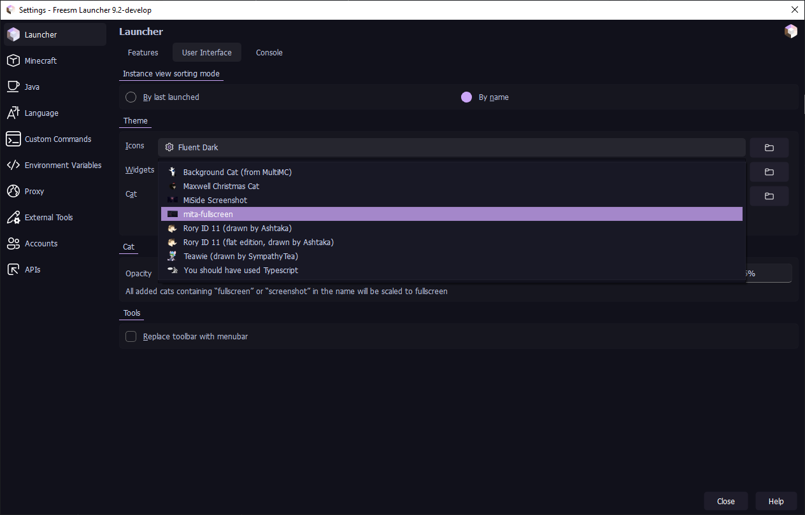

# Halky Launcher

A Halky Launcher fork that features an **excellent UI and rich customizations**, removes offline account restrictions, and adds custom auth server support.

*This fork is **not** endorsed by Prism Launcher or Freesm Launcher.*

---

## 📸 Screenshots

  
Click to expand

  

    
<em>Screenshots are temporarily removed</em>

    <!-- 
    

      
      
      
      
      
      
      
      
    

    -->
  

---

## ✨ Features

* **True Offline Mode:** Play without being forced to sign in with a Microsoft account.
* **Ely.by Integration:** Native support out of the box. See your custom skins anywhere without installing external mods or plugins.
* **Custom Authentication:** Full support for your own custom auth servers.
* **Smart Screenshots:** In-game screenshots are automatically copied directly to your clipboard history.
* **Winter Magic:** Animated snow effects for those who love winter vibes (automatically activates during winter).
* **Easy Content Installation:** Seamlessly download mods, shaders, modpacks, and resource packs via Modrinth and CurseForge.
* **FLOSS:** Fully Free, Libre, and Open Source Software.
* **All-in-One:** Includes all standard features from Prism Launcher and MultiMC.

---

## 📊 Comparison

| Feature | Halky Launcher | Freesm | Shattered Prism | HMCL | Fjord | PollyMC | PineconeMC | UltimMC | Prism-Cracked | Prism Launcher |
| :--- | :---: | :---: | :---: | :---: | :---: | :---: | :---: | :---: | :---: | :---: |
| **Modern & Beautiful UI** | ✅ | ❌ | ❌ | ❌ | ❌ | ❌ | ❌ | ❌ | ❌ | ❌ |
| **Offline Mode (No MS Account)** | ✅ | ✅ | ✅ | ✅ | ❌ | ✅ | ✅ | ✅ | ✅ | ❌ |
| **FTB Packs Support** | ✅ | ✅ | ✅ | ❌ | ✅ | ✅ | ✅ | ❌ | ✅ | ✅ |
| **Ely.by Support** | ✅ | ✅ | 🟨¹ | 🟨¹ | 🟨¹ | 🟨¹ | ✅ | 🟨¹ | ❌ | ❌ |
| **Authlib-injector Support** | ✅ | ✅ | ✅ | ✅ | ✅ | ✅ | ✅ | ❌² | ❌² | ❌² |
| **Animated Cat Packs & Cropping** | ✅ | ✅ | ❌ | ❌ | ❌ | ❌ | ❌ | ❌ | ❌ | ❌ |
| **Screenshots to Clipboard** | ✅ | ✅ | ❌ | ❌ | ❌ | ❌ | ❌ | ❌ | ❌ | ❌ |
| **Base Fork** | Freesm Launcher | PrismLauncher | FjordLauncher | ❌ | PollyMC | PrismLauncher | PrismLauncher | MultiMC | PrismLauncher | PolyMC |

> ¹ Does not use official Ely.by authlib patches.
> 
> ² You can still change the `javaagent` JVM argument to use your own `authlib-injector.jar` file.

---

## 🚀 Installation

### Stable Releases
Download **Halky Launcher** directly from our [GitHub Releases](https://github.com/oleksandr1811/HalkyLauncher/releases) page. Prebuilt packages are available for **Linux, Windows, and macOS**.

### Development Builds
> [!WARNING]
> These builds are experimental and intended for testing. They contain debug information (larger file size) and may be unstable.

You can find the latest automated development builds via [GitHub Actions](https://github.com/oleksandr1811/HalkyLauncher/actions) (includes artifacts from active Pull Requests).

---

## 🤝 Community & Support

If you encounter a bug or want to suggest an awesome feature, feel free to open a [GitHub Issue](https://github.com/oleksandr1811/HalkyLauncher/issues). Pull requests and any contributions (code, documentation, translations) are highly appreciated!

Join our official chat to discuss development or get quick help:
* **Telegram:** [Click to join :)](https://t.me/halky_launcher)

---

## 🛠️ Building from Source

To compile Halky Launcher by yourself, follow the official [Prism Launcher build instructions](https://prismlauncher.org/wiki/development/build-instructions/). 

> **Note:** Halky Launcher utilizes the **Garnix** build system.

---

## ℹ️ Important Information

* 🛑 **NO OFFICIAL WEBSITE:** We **DO NOT** have an official website or any other distribution platforms. GitHub is the only trusted place to download Halky Launcher.
* ⚠️ **NOT AFFILIATED:** We are **NOT** related to, or endorsed by, the official [Prism Launcher](https://prismlauncher.org) or [Freesm Launcher](https://freesmlauncher.org) teams.
* 🔒 **PRIVACY FRIENDLY:** We **DO NOT** collect any personal data. We only gather **anonymous telemetry** about installs and launches. Don’t trust us? Our source code is fully **open source** and available for inspection!
* 🎮 **FREE TO PLAY:** Our goal is to provide a fully accessible and clean way to enjoy Minecraft.
